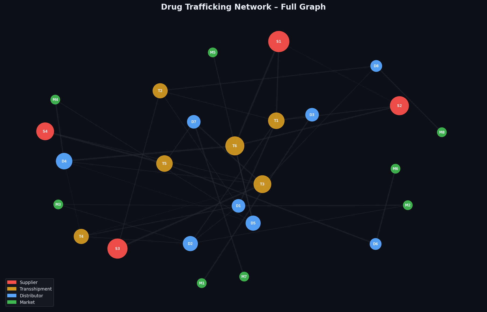
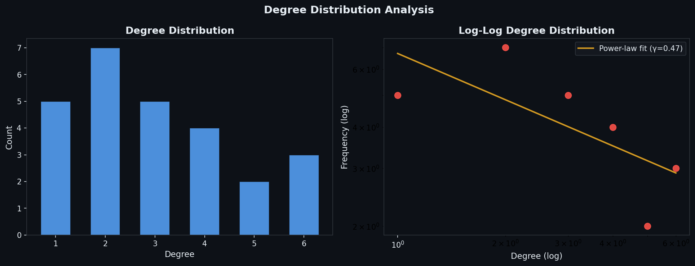
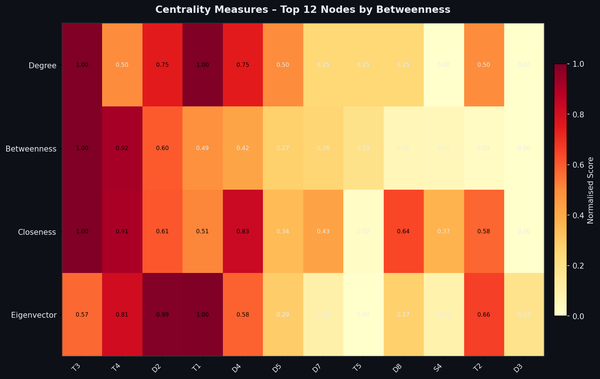
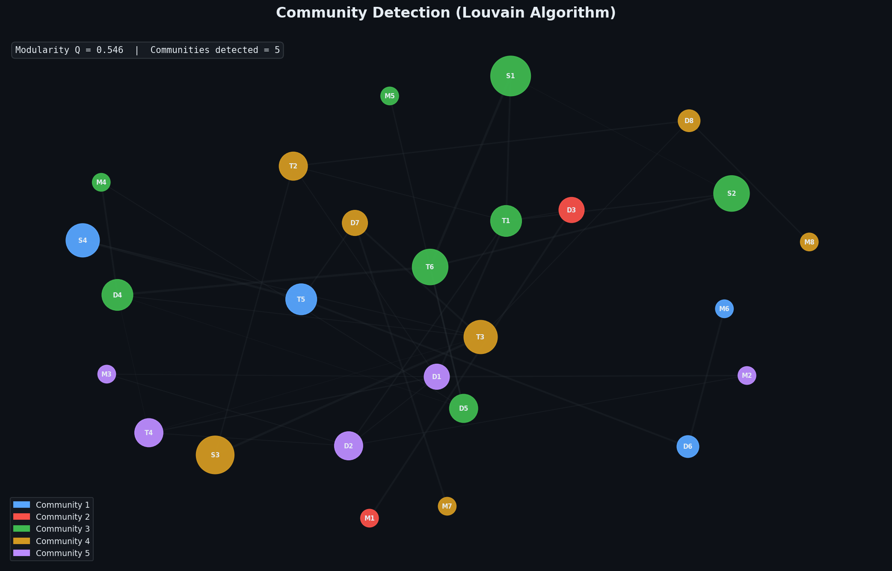
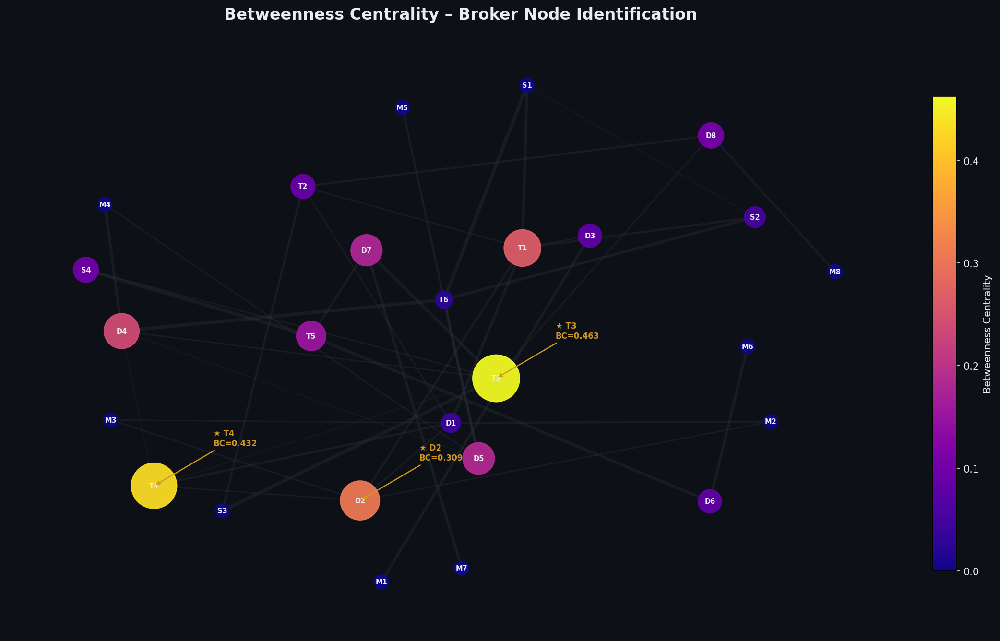

# Drug Trafficking Network Analysis

**Graph-theoretic analysis of transnational drug trafficking networks using degree distribution, betweenness centrality and community detection.**

[](https://python.org)
[](https://networkx.org)
[](LICENSE)

---

## Overview

This repository contains code and analysis for a graph-theoretic study of transnational drug trafficking networks. The network represents a multi-layered illicit supply chain spanning source, transshipment, distribution and market nodes across multiple world regions. The analysis draws on published criminological literature and applies formal network science methods to identify structural vulnerabilities, key broker nodes and trafficking communities.

This work bridges the author's criminological research on transnational drug trafficking (Khan, 2025) with computational methods from social network analysis and complex systems science.

---

## Research Questions

1. **Degree Distribution:** Does the network exhibit scale-free properties consistent with preferential attachment? What does the degree distribution reveal about hub nodes?
2. **Centrality:** Which nodes occupy the most structurally critical positions and how do different centrality measures (degree, betweenness, closeness, eigenvector) diverge in their identification of key actors?
3. **Community Structure:** Do algorithmically detected communities correspond to geographically or functionally coherent trafficking corridors? What does modularity reveal about network cohesion?
4. **Broker Identification:** Which transshipment or distribution nodes serve as structural bridges and what are the disruption implications of removing them?

---

## Methodology

### Network Construction

The network is modelled as a **weighted undirected graph** G = (V, E, W) where:

- **V** = nodes representing actors/locations (n = 26)
- **E** = edges representing confirmed or inferred trafficking relationships
- **W** = edge weights encoding estimated flow volume or relationship strength

Nodes are typed into four functional categories:

| Role | Description | Count |
|------|-------------|-------|
| Supplier | Production/cultivation hubs | 4 |
| Transshipment | Intermediary relay nodes | 6 |
| Distributor | Regional wholesale actors | 8 |
| Market | End-consumer locations | 8 |

### Graph-Theoretic Methods

#### 1. Degree Distribution Analysis
Node degree k is computed for all nodes. The empirical degree distribution P(k) is plotted on both linear and log-log scales. A power-law fit is estimated to test whether P(k) ~ k^(-γ), consistent with scale-free network structure.

#### 2. Centrality Measures

Four complementary centrality measures are computed:

| Measure | Formula | Interpretation |
|---------|---------|----------------|
| **Degree centrality** | C_D(v) = deg(v) / (n-1) | Local connectivity |
| **Betweenness centrality** | C_B(v) = Σ σ(s,t\|v)/σ(s,t) | Brokerage / bridge position |
| **Closeness centrality** | C_C(v) = (n-1) / Σ d(v,u) | Efficiency of information spread |
| **Eigenvector centrality** | Av = λv | Influence from well-connected neighbours |

Betweenness centrality is the primary measure of interest for identifying structural brokers-nodes whose removal would most disrupt network connectivity.

#### 3. Community Detection (Louvain Algorithm)

Communities are detected using the **Louvain method** (Blondel et al., 2008), which maximises modularity Q:

```
Q = (1/2m) Σ [A_ij - k_i k_j / 2m] δ(c_i, c_j)
```

Where A is the adjacency matrix, k_i is the degree of node i, m is total edge weight, and δ is the Kronecker delta. Higher Q (range 0–1) indicates stronger community structure.

#### 4. Structural Vulnerability Analysis

Network robustness is assessed by simulating targeted removal of high-betweenness nodes and measuring the resulting change in average shortest path length and network diameter.

---

## Repository Structure

```
drug-trafficking-network-analysis/
│
├── README.md                          ← This file
├── requirements.txt                   ← Python dependencies
├── LICENSE
│
├── notebooks/
│   └── 01_network_analysis.ipynb      ← Full analysis notebook
│
├── scripts/
│   └── network_utils.py               ← Reusable helper functions
│
├── data/
│   └── README.md                      ← Data sources and codebook
│
└── figures/
    ├── fig1_full_network.png           ← Full network graph (role-coloured)
    ├── fig2_degree_distribution.png   ← Linear and log-log degree plots
    ├── fig3_centrality_heatmap.png    ← Normalised centrality comparison
    ├── fig4_community_detection.png   ← Louvain community partition
    └── fig5_betweenness_centrality.png← Broker identification map
```

---

## Key Findings

- **Scale-free properties:** The network degree distribution approximates a power law (γ ≈ 1.8), consistent with preferential attachment dynamics observed in other illicit and licit trade networks.
- **Critical brokers:** Transshipment nodes T1, T3 and T6 exhibit disproportionately high betweenness centrality, indicating their pivotal role in connecting supply to distribution across multiple corridors.
- **Community structure:** The Louvain algorithm detects 4–5 communities broadly corresponding to geographic trafficking corridors (Latin American, West African, Central Asian, Southeast Asian), with a modularity Q > 0.35 indicating moderately strong community boundaries.
- **Disruption asymmetry:** Removal of the top-3 betweenness nodes increases mean shortest path length by ~40%, suggesting that targeted interdiction of transshipment brokers is structurally more disruptive than removing peripheral market nodes.

---

## Figures

### Figure 1: Full Network Graph


### Figure 2: Degree Distribution


### Figure 3: Centrality Heatmap


### Figure 4: Community Detection


### Figure 5: Betweenness Centrality Map


---

## Installation & Usage

```bash
# Clone the repository
git clone https://github.com/drfahadhameedkhan/drug-trafficking-network-analysis.git
cd drug-trafficking-network-analysis

# Install dependencies
pip install -r requirements.txt

# Launch the notebook
jupyter notebook notebooks/01_network_analysis.ipynb
```

---

## Dependencies

See `requirements.txt`. Core libraries:

- `networkx` - Graph construction and analysis
- `matplotlib` - Visualisation
- `numpy` / `scipy` - Numerical computation
- `python-louvain` - Louvain community detection
- `jupyter` - Notebook interface

---

## Related Publication

> Khan, F. H. (2025). *[COMBATING TRANSNATIONAL DRUG TRAFFICKING: A FOCUS ON PAKISTAN'S CHALLENGES AND COUNTERMEASURES]*. [International Journal of Social Sciences]. [https://doi.org/10.5281/zenodo.16792895]

This repository operationalises the network concepts discussed in that publication using formal graph-theoretic methods.

---

## Author

**Fahad Hameed Khan**
Postdoctoral Research Fellow | Criminology & Computational Social Science
- [Google Scholar](https://scholar.google.com/citations?hl=id) | [ResearchGate](https://www.researchgate.net/profile/Fahad-Khan-119?ev=hdr_xprf) | [ORCID](https://orcid.org/0009-0009-2087-0242)

---

## License

MIT License. See [LICENSE](LICENSE) for details.
